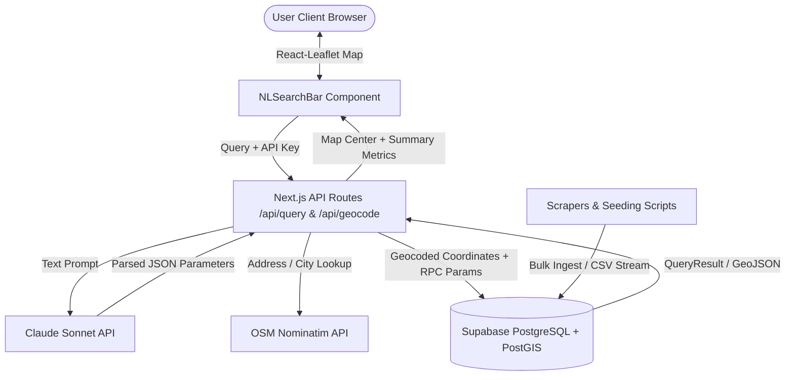
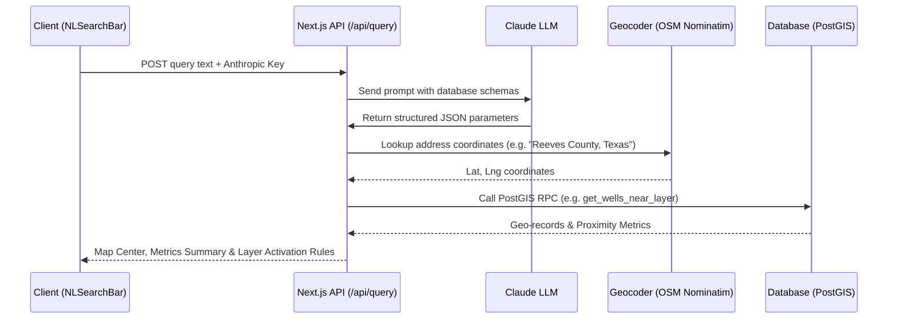

# Orphan Well Locator: Architectural and Operational Report

The **Orphan Well Locator** is a real-time web mapping application designed to analyze, visualize, and query the locations of abandoned/orphan oil & gas wells, groundwater wells, EPA contamination sites, active fracking sites, and FEMA flood zones across the United States. 

It implements a modern Next.js 15 frontend, a PostGIS-enabled Supabase backend, a Python-based data ingestion pipeline, and an AI natural language translation layer using the Anthropic Claude API.

---

## 1. High-Level System Architecture

The application is structured into three primary layers: the **Frontend client**, the **AI Query service**, and the **Spatial Database engine**.



---

## 2. Frontend Architecture & Components

The client application is built with **Next.js 15 (App Router)** and **TypeScript**. Since it is highly interactive and mapping-heavy, the core view uses client-side rendering (`"use client"`).

### Core Components
* **`app/page.tsx`**: The main entry point. It controls state toggles for map layers (Orphan Wells, Groundwater Wells, EPA Sites, FEMA Flood Zones, and Fracking Sites), the selection state of individual wells, map coordinates, loading states, and natural language summary outputs.
* **[Map.tsx](file:///home/andrewa/projects/orphan-well-location/components/Map.tsx)**: Integrates `react-leaflet` with CartoDB Dark Matter base tiles. Key responsibilities:
  * Dynamically queries data from the Supabase database matching the map viewport bounds (`queryBounds`) after a $400\text{ms}$ pan/zoom debounce.
  * Dynamically renders map features:
    * **Orphan Wells**: Color-coded by proximity or spud age. Marker radii correspond to well age: $<10$ yr ($5\text{px}$), $10\text{--}20$ yr ($6\text{px}$), $20+$ yr ($8\text{px}$), and $10\text{px}$ when selected.
    * **Groundwater Wells**: Rendered as blue markers ($4\text{px}$).
    * **EPA Contamination Sites**: Rendered as orange ($7\text{px}$ for Superfund), purple ($5\text{px}$ for Toxic Release Inventory - TRI), or yellow ($5\text{px}$ for Brownfields).
    * **Active Fracking Sites**: Rendered as deep pink markers ($5\text{px}$).
    * **FEMA Flood Zones**: Rendered as light blue bordered polygons (`GeoJSON`) with translucent blue fills.
  * Listens to browser Geolocation API on mount to fly the map to the user's local coordinates.
* **[Sidebar.tsx](file:///home/andrewa/projects/orphan-well-location/components/Sidebar.tsx)**: Shows live statistics (e.g., total wells in viewport, count of wells older than 20 years, closest well distance), toggles for individual map layers, and a scrollable list of wells currently in view. Includes the **Address Search** and **NL Search Bar** forms.
* **[AddressSearch.tsx](file:///home/andrewa/projects/orphan-well-location/components/AddressSearch.tsx)**: Performs real-time geocoding against OpenStreetMap's Nominatim endpoint. Requests are proxied through `/api/geocode` to enable data caching.
* **[LandingOverlay.tsx](file:///home/andrewa/projects/orphan-well-location/components/LandingOverlay.tsx)**: Renders a minimal dark splash screen presenting disclaimer warnings and datasets before granting access to the main dashboard.

---

## 3. Database Schema & PostGIS Functions

All spatial databases are hosted on **Supabase** and require the `postgis` extension. Geometries are stored as `geography` (typically WGS84, SRID 4326) to allow accurate distance calculations in meters on the Earth's spheroid.

### Database Schema Table Definitions

#### 1. `orphan_wells`
Represents abandoned and documented orphan oil and gas wells.
* `api_number` (text, PRIMARY KEY) - The unique API well identification code.
* `well_name` (text) - Name designation of the well.
* `latitude` / `longitude` (float8) - Explicit decimal degrees.
* `state` / `county` (text) - Local jurisdictions.
* `operator_name` (text) - Default operator of record.
* `well_type` / `well_status` (text) - Well classification and active/abandoned status.
* `spud_date` (date) - Drilling commencement date.
* `months_inactive` (float8) - Inactivity duration metric.
* `liability_est` (float8) - Financial liability estimate to plug the well.
* `geom` (geography) - PostGIS Geography point.

#### 2. `groundwater_wells`
Represents domestic and municipal water wells.
* `well_id` (text, PRIMARY KEY)
* `latitude` / `longitude` (float8)
* `state` / `county` (text)
* `well_depth_ft` (float8)
* `well_capacity_gpm` (float8)
* `water_use` / `status` (text)
* `year_constructed` (int4)
* `geom` (geography)

#### 3. `epa_sites`
Represents hazardous, contaminated, or regulated industrial locations.
* `site_id` (text, PRIMARY KEY)
* `site_name` (text)
* `latitude` / `longitude` (float8)
* `state` / `county` / `city` (text)
* `site_type` (text) - `'Superfund'`, `'Brownfield'`, or `'TRI'`.
* `status` / `contamination_type` / `npl_status` (text)
* `federal_facility` (boolean)
* `geom` (geography)

#### 4. `fema_flood_zones`
Represents high-risk flood polygons.
* `zone_id` (text, PRIMARY KEY)
* `zone_type` (text)
* `state_fips` (text)
* `geom` (geography/geometry)

#### 5. `fracking_sites`
Represents active oil and gas extraction sites utilizing hydraulic fracturing.
* `api_number` (text, PRIMARY KEY)
* `operator_name` / `well_type` (text)
* `geom` (geometry)

### PostGIS Query Optimizations

The application avoids full table scans using two database features:
1. **Spatial Indexes**: All tables contain GIST indexes on their `geom` column (e.g. `CREATE INDEX ON orphan_wells USING GIST (geom);`).
2. **Fast Sphere Math**: Radius-based search queries use the PostGIS `ST_DWithin` and `ST_Distance` functions with `use_spheroid = false`. This calculates distances using a perfect sphere instead of a spheroid, resulting in a 2-5x performance improvement.

#### Key RPC Database Functions

* **`get_wells_in_radius`**: Uses fast KNN index-based order (`<->`) to quickly retrieve orphan wells within a coordinate radius:
  ```sql
  CREATE OR REPLACE FUNCTION get_wells_in_radius(user_lng float8, user_lat float8, radius_meters float8)
  RETURNS TABLE (...) LANGUAGE sql STABLE AS $$
    SELECT ..., (ST_Distance(w.geom, ST_SetSRID(ST_MakePoint(user_lng, user_lat), 4326)::geography, false) / 1609.34) AS miles_away
    FROM orphan_wells w
    WHERE ST_DWithin(w.geom, ST_SetSRID(ST_MakePoint(user_lng, user_lat), 4326)::geography, radius_meters, false)
    ORDER BY w.geom <-> ST_SetSRID(ST_MakePoint(user_lng, user_lat), 4326)::geography LIMIT 500;
  $$;
  ```
* **`get_wells_near_layer`**: Performs proximity analysis. Given a reference layer (such as groundwater wells or EPA sites), it creates a bounding box bounding the search space to prevent full table scans and joins the target layer to find intersecting features.

---

## 4. AI Translation Layer (Natural Language Query)

The natural language search bar allows users to input queries like:
> *"Find orphan wells within 10 miles of groundwater wells in Reeves County, Texas"*

This flows through the Next.js API route `/api/query`, which processes the request in five steps:



### JSON Extraction and Validation
The LLM response is processed to extract clean JSON matching this schema:
```json
{
  "state": "Texas",
  "county": "Reeves",
  "extracted_city": null,
  "radius_miles": 10.0,
  "action": "proximity_analysis",
  "target_layer": "orphan_wells",
  "reference_layer": "groundwater_wells"
}
```

The API then maps the parsed attributes to database RPC calls, executes geocoding fallbacks if cities are not resolved, runs the spatial query, and outputs a response that updates the map's coordinates and toggle layers.

---

## 5. Data Scrapers & Seeding Pipelines

Data is compiled using specialized scripts located in the root and `/scripts` directories:

### Well Data Scrapers (`fetch_XX_wells.py`)
Individual Python scripts fetch data for specific states (AL, AR, CA, CO, IL, IN, KS, LA, MI, MO, MS, MT, ND, NE, NM, NV, NY, SD, TN, UT, WV, WY).
* **Colorado (`fetch_co_wells.py`)**: Queries the COGCC FeatureServer API directly for orphan wells, estimates liability, downloads groundwater sites via USGS NWIS API, and writes CSV files.
* **Liability Estimation Rules**:
  * Depth $\ge 8,000\text{ ft} \implies \$250,000$
  * Depth $\ge 3,000\text{ ft} \implies \$112,500$
  * Depth $< 3,000\text{ ft} \implies \$37,500$
  * No depth data $\implies \$37,500$ (default)

### Seeding Scripts
* **FEMA Ingestion (`scripts/seed-fema-data.ts`)**: Connects to the FEMA NFHL ArcGIS REST service, requests high-risk zones (A & V), and passes polygons to the `ingest_geometry_geojson` RPC function. It simplifies complex polygons using PostGIS `ST_SimplifyPreserveTopology(geom, 0.001)` to prevent database bloat.
* **Fracking Ingestion (`scripts/seed-fracking-data.ts`)**: Streams and parses the `rrc_active_wells.csv` file, converting lines into point geometries, and executing a bulk upsert with conflict resolution.

---

## 6. How to Run the Project Locally

To set up and run the codebase on your local machine, follow these steps:

### Prerequisites
* **Node.js**: Version 18.x or 20.x
* **Supabase Instance**: An active project with PostGIS extension enabled

### Setup Steps
1. **Configure Environment Variables**:
   Create a `.env.local` file in the root directory:
   ```env
   NEXT_PUBLIC_SUPABASE_URL=https://your-project.supabase.co
   NEXT_PUBLIC_SUPABASE_ANON_KEY=your-anonymous-key
   SUPABASE_SERVICE_ROLE_KEY=your-service-role-key # Required for seeding scripts only
   ```
2. **Install Dependencies**:
   ```bash
   npm install
   ```
3. **Database Migration**:
   Run the SQL statements from [optimize_postgis.sql](file:///home/andrewa/projects/orphan-well-location/optimize_postgis.sql), [create_relational_rpcs.sql](file:///home/andrewa/projects/orphan-well-location/create_relational_rpcs.sql), [epa_sites_setup.sql](file:///home/andrewa/projects/orphan-well-location/epa_sites_setup.sql), and [fema_setup.sql](file:///home/andrewa/projects/orphan-well-location/scripts/fema_setup.sql) in your Supabase SQL Editor.
4. **Seed the Data** (Optional):
   ```bash
   npx ts-node scripts/seed-fema-data.ts
   python3 scripts/import_to_supabase.py
   ```
5. **Start Dev Server**:
   ```bash
   npm run dev
   ```
   Open [http://localhost:3000](http://localhost:3000) to view the map.
